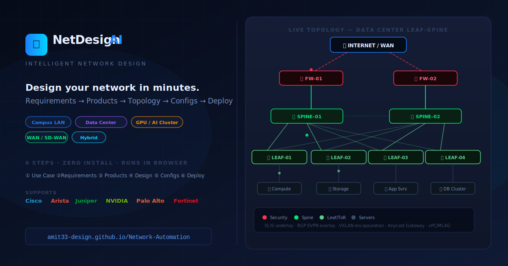

# 🌐 NetDesign AI — Intelligent Network Design Platform

[](https://amit33-design.github.io/Network-Automation/)
[](LICENSE)
[](index.html)
[](backend/)
[](playbooks/)

> **Design campus, data center, GPU/AI cluster, and WAN networks in minutes.**  
> Requirements → product selection → topology diagrams → device configs → deployment validation — entirely in your browser, zero install.



---

## 🚀 Live Demo

**[amit33-design.github.io/Network-Automation](https://amit33-design.github.io/Network-Automation/)**

No login required. Works on any modern browser. Click **⚡ Demo** for an instant pre-filled walkthrough.

---

## 📦 Repository

```
https://github.com/Amit33-design/Network-Automation
```

Clone:
```bash
git clone https://github.com/Amit33-design/Network-Automation.git
cd Network-Automation
```

---

## ✨ What It Does — 6 Steps

| Step | What you get |
|---|---|
| **1 — Use Case** | Pick Campus / DC / GPU Cluster / Hybrid / WAN + org details |
| **2 — Requirements** | Protocols, security, compliance, app flows, GPU/RoCEv2 options |
| **3 — Products** | AI-scored hardware SKUs from Cisco, Arista, Juniper, NVIDIA, PA, Fortinet |
| **4 — Design** | Interactive SVG topology (HLD) with **live animated packet flow** + IP plan, VLAN, BGP, physical tables (LLD) |
| **5 — Configs** | Production-ready IOS-XE / NX-OS / EOS / Junos / SONiC per device |
| **6 — Deploy** | Pre-checks → backup → push → commit-guard → post-checks dashboard |

---

## 🏗 Architecture Coverage

### Campus / Enterprise LAN
```
Internet → Firewall (HA) → Core → Distribution → Access → Endpoints
```
Cisco Cat9300/9500/9600 · OSPF/BGP · 802.1X · DHCP snooping · QoS/Voice

### Data Center Leaf-Spine (CLOS)
```
Border FW → Spine (×2) → Leaf (×N) → Servers
```
Nexus 93180/9336C · Arista 7050CX3/7280R3 · IS-IS underlay · BGP EVPN · VXLAN overlay

### AI / GPU Cluster
```
GPU Spine → GPU TOR → H100/A100 GPU Servers
Storage Spine → Storage Leaf → GPU Servers (NVMe-oF / NFS)
OOB Management → All devices
```
NVIDIA SN4600C/SN4800 · Arista 7060X4 · RoCEv2 · PFC · ECN/DCQCN · SHARP in-network compute

### WAN / SD-WAN
```
HQ Core ↔ MPLS/Internet ↔ Branch CPEs (×N)
```
Cisco ISR/ASR · Fortinet FortiGate · BGP · VRF · ZTP

---

## 📦 25+ Hardware SKUs Evaluated

| Layer | Cisco | Arista | Juniper | NVIDIA |
|---|---|---|---|---|
| Campus Access | Cat9300-24P/48P | 720XP-48ZC2 | EX2300-48P | — |
| Distribution | Cat9500-48Y4C | 7280R2A-30 | EX4650-48Y | — |
| Core | Cat9600-32C | 7500R3 | — | — |
| DC Leaf | Nexus 93180YC-FX / 93360YC-FX2 | 7050CX3-32S | QFX5120-48Y | — |
| DC Spine | Nexus 9336C-FX2 / 9364D-GX | 7280R3-48YC6 | QFX10002-60C | — |
| GPU TOR | Nexus 9336C-FX2 | 7060X4-32S | — | SN4600C / SN2700 |
| GPU Spine | — | 7800R3 | — | SN4800 |
| Firewall | Firepower 4145 | — | SRX4600 | — |
| Firewall | PA-3440 / PA-5445 | — | — | — |
| Firewall | FortiGate 1800F | — | — | — |

---

## ⚙️ Config Platforms

| Platform | Devices | Notable configs generated |
|---|---|---|
| **Cisco IOS-XE** | Campus access/dist/core | VLANs, STP, 802.1X, DHCP snooping, DAI, OSPF/BGP, PortFast/BPDUguard, HSRP |
| **Cisco NX-OS** | DC spine/leaf, GPU TOR | IS-IS, BGP EVPN, VXLAN NVE, vPC, anycast GW, PFC/ECN/DCQCN, gRPC telemetry |
| **Arista EOS** | DC spine/leaf, GPU spine | BGP EVPN, VXLAN, IRB, ECMP, PFC/RoCEv2, gNMI/CloudVision-ready |
| **Juniper Junos** | Any layer | Hierarchical config, OSPF/BGP, EVPN, IRB, policy-options, Apstra-ready |
| **NVIDIA SONiC** | GPU TOR | config_db.json + PFC/WRED/ECN QoS JSON + PFC watchdog |

---

## 🚀 Quick Start — Frontend (No Setup)

### Try it live (no install)
```
https://amit33-design.github.io/Network-Automation/
```

### Run locally
```bash
git clone https://github.com/Amit33-design/Network-Automation.git
cd Network-Automation
open index.html       # macOS
start index.html      # Windows
xdg-open index.html   # Linux
```

Single static HTML file — no npm, no build step, no server required.

### Test the frontend
1. Open `index.html` in Chrome / Firefox / Safari
2. Click **⚡ Demo** → select **Data Center**, **GPU Cluster**, or **Campus** scenario
3. Click through all 6 steps — topology animates with live packet flow dots
4. At Step 5, select a device from the dropdown to see platform-specific config
5. At Step 6, click **Run Pre-Checks** → **Deploy** → **Run Post-Checks** (simulated in browser)

---

## 🐍 Backend — Python FastAPI + Nornir

The backend enables **real device deployment** when you have physical/virtual network gear.

### Requirements
- Python 3.11+
- pip packages (see `backend/requirements.txt`)

### Install
```bash
cd backend
python3 -m venv venv
source venv/bin/activate          # Windows: venv\Scripts\activate
pip install -r requirements.txt
```

### Run the API server
```bash
uvicorn main:app --host 0.0.0.0 --port 8000 --reload
```

API docs auto-generated at: **http://localhost:8000/docs**

### API Endpoints

| Method | Endpoint | Description |
|---|---|---|
| `GET` | `/` | Health check |
| `GET` | `/api/inventory` | List hosts from Ansible inventory |
| `POST` | `/api/generate-configs` | Render Jinja2 configs (no device needed) |
| `POST` | `/api/pre-checks` | Reachability + SSH + version + backup |
| `POST` | `/api/deploy` | Push configs (dry_run=true by default) |
| `POST` | `/api/post-checks` | BGP/OSPF/EVPN/NVE/vPC/PFC validation |

### Test config generation (no devices needed)
```bash
curl -s -X POST http://localhost:8000/api/generate-configs \
  -H "Content-Type: application/json" \
  -d '{
    "uc": "dc",
    "orgName": "TestOrg",
    "orgSize": "large",
    "redundancy": "ha",
    "selectedProducts": {
      "dc-spine": "nexus-9336c",
      "dc-leaf":  "nexus-93180"
    },
    "protocols": ["bgp", "is-is", "evpn"],
    "vlans": [
      {"id": 10, "name": "PROD", "gw": "192.168.10.1"},
      {"id": 20, "name": "DEV",  "gw": "192.168.20.1"}
    ]
  }' | python3 -m json.tool
```

### Test dry-run deploy (no devices needed)
```bash
curl -s -X POST http://localhost:8000/api/deploy \
  -H "Content-Type: application/json" \
  -d '{
    "state": {
      "uc": "campus",
      "orgName": "TestOrg",
      "orgSize": "medium",
      "redundancy": "single",
      "selectedProducts": {"campus-access": "cat9300-24p"},
      "protocols": ["ospf"],
      "security": ["802.1x"],
      "vlans": [{"id": 10, "name": "DATA"}]
    },
    "inventory": {},
    "dry_run": true
  }' | python3 -m json.tool
```

### Test with real devices
1. Edit `playbooks/inventory/hosts.yml` — replace IPs with real device IPs
2. Set `dry_run: false` in the deploy request
3. Ensure SSH access to devices (Netmiko uses port 22)

---

## 🤖 Ansible Playbooks

### Requirements
```bash
pip install ansible
ansible-galaxy collection install cisco.ios cisco.nxos arista.eos junipernetworks.junos
```

### Edit inventory
```bash
# Set real device IPs in:
vi playbooks/inventory/hosts.yml

# Set passwords (use vault in production):
vi playbooks/group_vars/all.yml
```

### Encrypt passwords with Ansible Vault
```bash
ansible-vault encrypt_string 'MySecret123' --name 'vault_dc_password'
# Paste the output into group_vars/all.yml
```

### Run pre-checks (safe — read-only)
```bash
cd playbooks
ansible-playbook pre_checks.yml -i inventory/hosts.yml --ask-vault-pass
# Run only for DC:
ansible-playbook pre_checks.yml -i inventory/hosts.yml --tags dc
```

### Deploy — dry run first (always!)
```bash
# Dry run — shows what WOULD change, touches nothing:
ansible-playbook deploy_campus.yml -i inventory/hosts.yml --check --diff

# Real deploy (campus):
ansible-playbook deploy_campus.yml -i inventory/hosts.yml --ask-vault-pass

# Real deploy (data center):
ansible-playbook deploy_dc.yml -i inventory/hosts.yml --ask-vault-pass
```

### Run post-checks
```bash
ansible-playbook post_checks.yml -i inventory/hosts.yml --ask-vault-pass
# Only GPU cluster checks:
ansible-playbook post_checks.yml -i inventory/hosts.yml --tags gpu
```

### Targeted deploys with tags
```bash
# Only access layer:
ansible-playbook deploy_campus.yml --tags access

# Only spines in DC:
ansible-playbook deploy_dc.yml --tags spine

# Post-checks summary only:
ansible-playbook post_checks.yml --tags summary
```

---

## 🗂 Project Structure

```
Network-Automation/
├── index.html                   # Full frontend (~6000 lines, zero dependencies)
├── preview.svg                  # OG social-share preview image (1200×630)
├── .nojekyll                    # GitHub Pages — disable Jekyll processing
├── README.md
│
├── backend/                     # Python backend (FastAPI + Nornir)
│   ├── main.py                  # REST API — 5 endpoints
│   ├── config_gen.py            # Jinja2 config generation engine
│   ├── nornir_tasks.py          # Parallel deployment via Netmiko/NETCONF
│   ├── nornir_config.yaml       # Nornir runner + inventory config
│   ├── requirements.txt         # Python dependencies
│   └── templates/               # Per-platform Jinja2 templates
│       ├── ios_xe/
│       │   ├── access.j2        # Campus access (802.1X, DHCP snoop, DAI, QoS)
│       │   ├── distribution.j2  # Distribution (OSPF, HSRP, STP root)
│       │   └── core.j2          # Core (OSPF, BGP, default route)
│       ├── nxos/
│       │   ├── spine.j2         # DC spine (BGP RR, IS-IS/OSPF, BFD)
│       │   └── leaf.j2          # DC leaf (VXLAN, EVPN, anycast-GW, vPC, telemetry)
│       ├── eos/
│       │   └── gpu_spine.j2     # GPU spine (BGP ECMP, PFC/RoCEv2, gNMI)
│       ├── sonic/
│       │   └── gpu_tor.j2       # GPU TOR (config_db JSON, WRED/ECN, PFC watchdog)
│       └── junos/
│           └── generic.j2       # Junos (hierarchical, OSPF/BGP, IRB, policy)
│
└── playbooks/                   # Ansible automation
    ├── deploy_campus.yml        # Campus: Access→Dist→Core (serial, backup, assert)
    ├── deploy_dc.yml            # DC: Spine→Leaf (EVPN wait, NVE assert, vPC check)
    ├── pre_checks.yml           # Reachability, version, backup, BGP/vPC baseline
    ├── post_checks.yml          # OSPF/BGP/EVPN/NVE/vPC/PFC validation + summary
    ├── inventory/
    │   └── hosts.yml            # All devices (campus/dc/gpu/fw) with vault refs
    └── group_vars/
        └── all.yml              # VLANs, BGP ASNs, NTP, SNMP, confirm-commit timer
```

---

## 🛠 Tech Stack

**Frontend** — zero dependencies, pure browser
- HTML5 · CSS3 · Vanilla ES2020 JavaScript
- SVG with `animateMotion` + `mpath` for live packet-flow topology animations
- CSS custom properties, Grid, Flexbox, `@keyframes` animations
- `localStorage` session persistence · Web Share API · Open Graph meta tags

**Backend** (Python, optional — for real device push)

| Library | Role |
|---|---|
| [FastAPI](https://fastapi.tiangolo.com/) | REST API + auto Swagger docs |
| [Nornir](https://nornir.readthedocs.io/) | Parallel task runner (10 workers) |
| [Netmiko](https://github.com/ktbyers/netmiko) | SSH to IOS-XE / NX-OS / EOS / Junos |
| [ncclient](https://github.com/ncclient/ncclient) | NETCONF transport |
| [Jinja2](https://jinja.palletsprojects.com/) | Config templating per platform |
| [NAPALM](https://napalm.readthedocs.io/) | Multi-vendor abstraction |
| [TextFSM](https://github.com/google/textfsm) | CLI output parsing |

**Automation** (Ansible)

| Playbook | What it does |
|---|---|
| `pre_checks.yml` | SSH probe, version collect, running-config backup, BGP/vPC baseline |
| `deploy_campus.yml` | IOS-XE push (serial=1) with OSPF assert + DHCP snooping verify |
| `deploy_dc.yml` | NX-OS push (serial=2 for vPC pairs) with NVE/EVPN/vPC validation |
| `post_checks.yml` | Full health check: OSPF/BGP/EVPN/NVE/PFC/queue-drops + ping test |

---

## 🗺 Roadmap

- [x] 6-step design wizard
- [x] AI product recommendation with fit scoring
- [x] Interactive SVG HLD topology diagrams with **animated live packet flow**
- [x] Full LLD: IP plan, VLAN, BGP, physical connectivity
- [x] Multi-platform config generator (5 OS families)
- [x] Deploy pipeline + pre/post check dashboard
- [x] Demo mode, keyboard shortcuts, localStorage, mobile responsive
- [x] GitHub Pages live hosting + OG preview image
- [x] Python FastAPI + Nornir backend (config gen + real device deploy)
- [x] 7 production Jinja2 templates (IOS-XE, NX-OS, EOS, Junos, SONiC)
- [x] Ansible playbooks (campus + DC deploy + pre/post checks)
- [ ] PDF design document export
- [ ] Multi-site combined topology view
- [ ] Live NAPALM device connectivity test from browser
- [ ] Cisco NSO / Crosswork integration
- [ ] Arista CloudVision API integration
- [ ] IPv6-only design mode
- [ ] Config diff viewer (before/after when regenerating)

---

## 📄 License

MIT © 2024 Amit Tiwari — contributions welcome!
