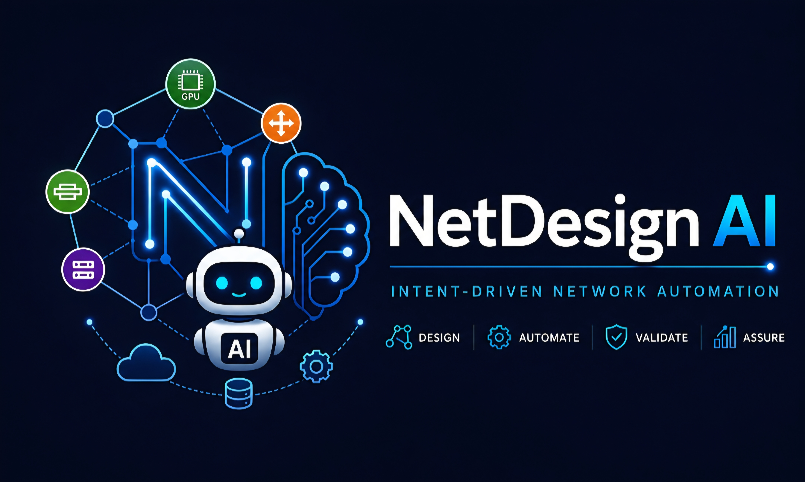
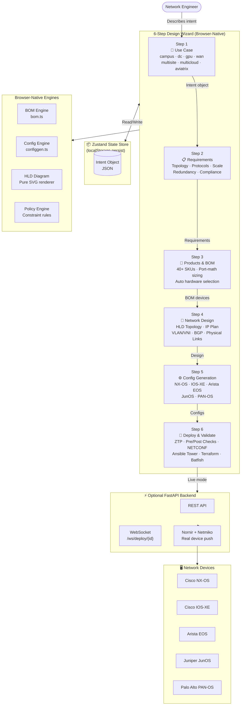

<div align="center">



# NetDesign AI

**Intent-Driven Network Automation**

[](https://netdesignai.com)
[](frontend/src/test)
[](frontend)
[](LICENSE)

*From network intent to production-ready design in minutes — browser-native, AI-powered, no backend required*

[**→ Launch App**](https://netdesignai.com) · [**→ Try Demo**](https://amit33-design.github.io/Network-Automation/) · [**→ Docs**](#documentation)

</div>

---

## What is NetDesign AI?

NetDesign AI (NDAL) is a browser-native, intent-driven network design and automation tool. You describe what you need — use case, scale, vendor preferences, compliance requirements — and the tool produces a complete bill of materials, professional HLD topology diagram, device configurations for 5 OS platforms, and a gate-enforced deployment pipeline.

No backend, no signup, no cloud dependencies. Everything runs in the browser.

---

## System Architecture

```
┌─────────────────────────────────────────────────────────────────────────────┐
│                    NETDESIGN AI — SYSTEM OVERVIEW                           │
│                                                                             │
│  ┌─── INTENT INPUT ──────────────────────────────────────────────────────┐  │
│  │  Use Case · Scale · Vendor · Compliance · Topology · Protocols        │  │
│  └───────────────────────────────────────┬───────────────────────────────┘  │
│                                          │                                  │
│                                    Intent Object (JSON)                     │
│                                    Zustand persist store                    │
│                                          │                                  │
│  ┌─── 6-STEP WIZARD ─────────────────────▼───────────────────────────────┐  │
│  │                                                                        │  │
│  │  Step 1          Step 2          Step 3          Step 4               │  │
│  │  ┌──────────┐   ┌──────────┐   ┌──────────┐   ┌──────────────────┐  │  │
│  │  │ Use Case │──▶│  Reqmts  │──▶│  BOM     │──▶│ Network Design   │  │  │
│  │  │ 7 types  │   │ topology │   │ 40+ SKUs │   │ HLD·IP·VLAN·BGP  │  │  │
│  │  └──────────┘   └──────────┘   └──────────┘   └──────────────────┘  │  │
│  │                                                         │             │  │
│  │  Step 6                    Step 5                       │             │  │
│  │  ┌─────────────────────┐  ┌────────────────┐           │             │  │
│  │  │  Deploy & Validate  │◀─│  Config Gen    │◀──────────┘             │  │
│  │  │ ZTP·Checks·NETCONF  │  │ 5 OS platforms │                         │  │
│  │  └─────────────────────┘  └────────────────┘                         │  │
│  └────────────────────────────────────────────────────────────────────────┘  │
│                                                                             │
│  ┌─── BROWSER-NATIVE ENGINES ────────────────────────────────────────────┐  │
│  │  BOM Engine      │  Config Engine   │  HLD Diagram     │  Policy Gate │  │
│  │  Port-math sizing│  NX-OS/IOS/EOS/  │  Pure SVG · all  │  Change win/ │  │
│  │  40+ SKU library │  JunOS/PAN-OS    │  layers animated │  Blast radius│  │
│  └──────────────────┴──────────────────┴──────────────────┴──────────────┘  │
│                                                                             │
│  ┌─── OPTIONAL BACKEND (FastAPI) ────────────────────────────────────────┐  │
│  │  /api/lab/topology  /api/lab/ztp  /api/checks  /api/deploy           │  │
│  │  /api/alerts        /api/rca      /ws/deploy/{id}  (WebSocket)       │  │
│  │                                                                        │  │
│  │  Nornir + Netmiko → Real Device Push (NX-OS · IOS-XE · EOS · JunOS) │  │
│  └────────────────────────────────────────────────────────────────────────┘  │
└─────────────────────────────────────────────────────────────────────────────┘
```

### Data Flow Diagram



### Component Architecture

```
frontend/src/
├── pages/                      # 6-step wizard pages
│   ├── Step1UseCase.tsx         # Use case + org details
│   ├── Step2Requirements.tsx    # Network requirements form
│   ├── Step2Design.tsx          # BOM output + topology summary
│   ├── Step4NetworkDesign.tsx   # 9-tab design workbench (1500 lines)
│   ├── Step3Config.tsx          # Config generation + CodeMirror viewer
│   └── Step6Deploy.tsx          # Deploy pipeline + ZTP + checks (2900 lines)
│
├── components/
│   ├── HLDTopologyDiagram.tsx   # Professional SVG topology renderer
│   ├── LandingPage.tsx          # Marketing landing page
│   ├── TroubleshootingEngine.tsx # Network troubleshooting AI
│   ├── BackendToggle.tsx        # Live/Sim mode toggle + context
│   ├── wizard/Sidebar.tsx       # Navigation sidebar with deep-links
│   └── ui/                     # Badge · Button · Card · Toast
│
├── lib/
│   ├── bom.ts                   # BOM engine + port-math formulas
│   ├── configgen.ts             # Config generation (5 platforms, 36 tests)
│   ├── products.ts              # 40+ SKU database
│   └── utils.ts                 # Shared utilities
│
├── hooks/
│   ├── useZTP.ts                # ZTP API + demo simulation
│   ├── useChecks.ts             # Pre/post check API
│   ├── useMonitoring.ts         # Health polling
│   ├── useTopology.ts           # Lab topology API
│   ├── useAlerts.ts             # Alert polling (30s)
│   └── useRca.ts                # RCA mutation
│
├── store/
│   └── useAppStore.ts           # Zustand 5 + localStorage persist
│
└── test/                        # 127 Vitest tests across 9 suites
```

---

## 6-Step Wizard

| Step | Name | Key Features |
|------|------|-------------|
| **1** | Use Case | 7 use cases · Org details · Vendor preferences · Compliance (PCI, SOC2, HIPAA) |
| **2** | Requirements | Traffic pattern · Endpoints · Bandwidth · Underlay/overlay protocols · Redundancy model |
| **3** | Products & BOM | Port-math auto-sizing · 40+ SKUs · Per-layer hardware selection · Cabling + optics BOM |
| **4** | Network Design | HLD topology · IP plan · VLAN/VNI design · BGP routing · Physical cabling · Simulation |
| **5** | Config Gen | NX-OS · IOS-XE · Arista EOS · JunOS · PAN-OS · Per-device download · ZBF firewall configs |
| **6** | Deploy & Validate | Deploy pipeline · ZTP state machine · Pre/post checks · NETCONF · Ansible Tower · Terraform |

---

## Key Features

### HLD Topology Diagram
- Pure SVG renderer — no react-flow/d3/cytoscape dependencies
- All network layers: Internet → WAN Edge → Corp FW → Edge FW → Spine/Core → Leaf/Dist → Access → Hosts/GPU
- Per-device boxes with hostname, model, loopback IP, HA role, ASN badge
- Animated packet flows along active path (3-packet staggered trail)
- Ambient always-on background packets on all links
- Clickable device detail panel (click any node)
- 6 packet flow scenarios per use case
- **Primary Path Only** toggle — hide non-flow devices
- Security zone shading (Internet / DMZ / Core / Access)
- SVG export + CSV LLD export

### Config Generation Engine (5 Platforms)
```
NX-OS     — VXLAN/EVPN leaf-spine, IS-IS underlay, BGP EVPN overlay
IOS-XE    — ZBF firewall (zone security / zone-pair / policy-map inspect)
Arista EOS — VXLAN/EVPN, MLAG, CVX integration
JunOS     — BGP RR, MPLS/SR, commit confirmed auto-rollback
PAN-OS    — Security policy set commands, zone-based rules
```
**5 rules enforced by 36 Vitest tests:**
1. No duplicate config blocks
2. Real firewall configs (ZBF for IOS-XE, set commands for PAN-OS)
3. No hardcoded secrets — `<CHANGE-ME-*>` placeholders only
4. Single underlay: IS-IS for DC/GPU, OSPF for WAN/campus
5. GPU QoS: PFC priority 3 no-drop, ECN/WRED, RDMA 60% BW, DCQCN

### Deploy & Validate Pipeline
```
Policy Gate → Canary Deploy → Pre-checks → Backup → Config Push → Verify → Post-checks
```
- **Policy & Approval Gate** — change window, peer review, blast-radius check
- **Canary mode** — deploy one device first, confirm before full rollout
- **ZTP simulation** — 8-stage state machine with fault injection + visual progress strips
- **Pre/Post Checks** — 13 checks/device across Connectivity · Protocols · Config · Hardware
- **NETCONF interactive** — build + execute NETCONF RPCs with live XML editor
- **Config Automation** — Ansible Tower/AWX · Terraform (NSO/Netbox) · Script download
- **Batfish validation** — offline config analysis framework integration
- **Platform-native rollback** — NX-OS checkpoint · IOS-XE configure replace · JunOS commit confirmed

### Network Design Workbench (9 Tabs)
| Tab | Content |
|-----|---------|
| HLD Diagram | Animated topology with packet flows |
| IP Plan | Subnet allocation per layer + per-device IP table |
| VLAN Design | VLAN + VNI mapping table |
| Routing & Protocols | BGP peer table · OSPF areas · Protocol summary |
| Physical Links | Cabling schedule with port assignments |
| Mermaid Diagram | Exportable Mermaid topology code |
| Simulate | Failure blast-radius · Reachability matrix · Route propagation |
| Summary | Design text + BOM table + compliance badges |
| Reference Designs | Cisco CVD · NDFC · NVIDIA Air · Juniper WAN · Arista AVD · Aviatrix |

---

## Supported Use Cases

| Use Case | Protocols | Typical Scale |
|----------|-----------|---------------|
| **Campus/Enterprise** | OSPF · STP · MSTP · RSTP · VSS/StackWise | 100–5000 endpoints |
| **Data Center Leaf-Spine** | IS-IS + VXLAN/EVPN · BGP RR · BFD | 500–50000 endpoints |
| **AI/GPU Cluster** | RoCEv2 · PFC priority 3 · ECN/DCQCN · RDMA | 8–1024 GPUs |
| **WAN/SD-WAN** | BGP · OSPF · MPLS · SR-TE · BFD | Multi-site |
| **Multi-Site DCI** | EVPN type-5 · vPC/MLAG · DCI fabric | 2–10 sites |
| **Multi-Cloud** | BGP · Aviatrix Transit · FQDN filtering | AWS/Azure/GCP |

---

## Supported Platforms

| Platform | Config Style | Key Features |
|----------|-------------|-------------|
| **Cisco NX-OS** | CLI / NXAPI | VXLAN/EVPN · VPC · IS-IS · OSPF · Checkpoint rollback |
| **Cisco IOS-XE** | CLI / NETCONF/YANG | ZBF · OSPF · BGP · Configure-replace rollback |
| **Arista EOS** | CLI / eAPI | VXLAN/EVPN · MLAG · OpenConfig · Checkpoint rollback |
| **Juniper JunOS** | CLI / NETCONF | BGP RR · MPLS · Commit-confirmed auto-rollback |
| **Palo Alto PAN-OS** | Set commands | Zone-based firewall · Security policies |

---

## Quick Start

### Option 1 — Browser (no install)
```
https://netdesignai.com  ←  production
https://amit33-design.github.io/Network-Automation/  ←  GitHub Pages demo
```

### Option 2 — Local Development
```bash
git clone https://github.com/Amit33-design/Network-Automation.git
cd Network-Automation/frontend
npm ci
npm test          # 127 tests
npm run build     # Vite production build
npm run dev       # Dev server → http://localhost:5173
```

### Option 3 — Docker (full stack)
```bash
cp .env.example .env    # Set JWT_SECRET, POSTGRES_PASSWORD, REDIS_PASSWORD
docker compose up --build
```
| Service | URL |
|---------|-----|
| Web UI | http://localhost:5173 |
| API + Swagger | http://localhost:8000/docs |
| Backend | http://localhost:8000 |

### Option 4 — Live Backend Toggle
The app includes a **SIM / LIVE** toggle in the top-right corner:
- **SIM** — fully client-side simulation, no backend needed (default)
- **LIVE** — connects to a FastAPI backend at the configured URL

---

## Backend API Endpoints

```
GET  /api/alerts              ← Alert polling (30s interval)
POST /api/rca/analyze         ← Root cause analysis
POST /api/generate-configs    ← Config generation
POST /api/pre-checks          ← Pre-deployment checks
POST /api/post-checks         ← Post-deployment checks
POST /api/deploy              ← Trigger deployment
WS   /ws/deploy/{id}         ← Live deploy progress stream
GET  /api/lab/topology        ← Demo device topology
POST /api/lab/ztp             ← ZTP simulation
POST /api/lab/checks          ← Check simulation
POST /api/lab/monitoring      ← Health monitoring simulation
```

---

## Tech Stack

### Frontend
| Technology | Version | Purpose |
|-----------|---------|---------|
| React | 19 | UI framework |
| TypeScript | 6 | Type safety |
| Vite | 8 | Build + dev server |
| Tailwind CSS | v4 | Styling |
| Zustand | 5 | State management + localStorage persist |
| TanStack Query | v5 | Server state (useQuery / useMutation) |
| Vitest | 4 | Testing (127 tests, 9 suites) |

### Backend (optional)
| Technology | Purpose |
|-----------|---------|
| FastAPI | REST API + WebSocket |
| Nornir | Network automation framework |
| Netmiko | SSH device connection |
| Python 3.11 | Runtime |

### Deployment
| Platform | Use |
|---------|-----|
| Vercel | Frontend (netdesignai.com) |
| Railway | Backend API |
| GitHub Pages | Demo site |
| Docker Compose | Self-hosted full stack |

---

## Project Structure

```
Network-Automation/
├── frontend/                   # React 19 + TypeScript app
│   ├── src/
│   │   ├── pages/              # 6 wizard steps
│   │   ├── components/         # UI components
│   │   ├── lib/                # BOM + config engines
│   │   ├── hooks/              # API hooks (TanStack Query)
│   │   ├── store/              # Zustand state
│   │   └── test/               # 127 Vitest tests
│   ├── public/
│   │   ├── favicon.svg         # Circuit-N brand icon
│   │   └── logo-brand.jpg      # Full brand image
│   ├── index.html
│   ├── package.json
│   └── vite.config.ts
│
├── backend/                    # FastAPI + Nornir (optional)
│   ├── main.py
│   ├── routers/
│   └── requirements.txt
│
├── docker-compose.yml
├── CLAUDE.md                   # AI assistant instructions
├── README.md                   # This file
└── LICENSE                     # NDAL v1.0
```

---

## Development Guide

### Adding a New Use Case
1. Add to `UseCase` union in `frontend/src/types/index.ts`
2. Add topology builder in `HLDTopologyDiagram.tsx` (`build<Name>Topology`)
3. Add BOM rules in `lib/bom.ts` (`buildDeviceList`)
4. Add config generation in `lib/configgen.ts`
5. Add reference design in `Step4NetworkDesign.tsx` (`REF_DESIGNS`)
6. Run `npm test` — 127 tests must pass

### Adding a New Platform
1. Add to `PLATFORM_CONFIGS` in `lib/configgen.ts`
2. Add vendor detection in `configgen.ts` platform switch
3. Write Vitest tests in `test/configgen.test.ts`
4. Run `npm test` — all 36 config tests must pass

### Commit Convention
```
feat:    New feature
fix:     Bug fix
chore:   Build/tooling/deps
docs:    Documentation
test:    Tests only
refactor: Code restructure (no behavior change)
```

---

## Config Generation Rules

These rules are enforced by **36 Vitest tests** and must never be broken:

| Rule | Description |
|------|-------------|
| **R-1** | No duplicate blocks — `mgmtBlock()` called exactly once per device |
| **R-2** | Real firewall configs — Cisco = IOS-XE ZBF, Palo Alto = PAN-OS set commands |
| **R-3** | No hardcoded secrets — all credentials use `<CHANGE-ME-*>` placeholders |
| **R-4** | Single underlay — IS-IS for DC/GPU, OSPF for WAN/campus, never both |
| **R-5** | GPU QoS — PFC priority 3 no-drop, ECN/WRED, RDMA 60% BW, pfc-watchdog |

---

## Known Gaps (Open Items)

| ID | Gap | Priority | Status |
|----|-----|----------|--------|
| G-A1 | Intent NLP parser — free-text → Step 1 form fields | P1 | Open |
| G-A2 | Professional HLD diagram | P1 | ✅ 2026-05-29 |
| G-A3 | Batfish/pyATS dry-run validation | P1 | Open |
| G-A4 | Config drift detection | P1 | Open |
| G-A5 | Canary deployment gate | P1 | ✅ 2026-05-26 |
| G-A6 | ZTP file server (nginx + TFTP) | P1 | Open |
| G-A7 | Embedded monitoring stack (VictoriaMetrics + Grafana) | P1 | Open |
| G-A8 | gNMI / streaming telemetry | P2 | Open |
| G-A9 | IOS-XR support (SR-MPLS, L3VPN) | P2 | Open |
| G-A10 | Private 5G / O-RAN use case | P2 | Open |

---

## License

**NetDesign AI License (NDAL) v1.0** © 2026 Amit Tiwari

- ✅ Free for personal use, learning, evaluation
- ✅ Fork and modify for personal/educational purposes
- ❌ Commercial use requires a paid license
- ❌ No redistribution or SaaS resale without written permission

Contact: **atiwari824@gmail.com** · [netdesignai.com](https://netdesignai.com)

---

<div align="center">

Built by **Amit Tiwari** · Powered by Claude AI

[netdesignai.com](https://netdesignai.com) · [GitHub](https://github.com/Amit33-design/Network-Automation)

</div>
